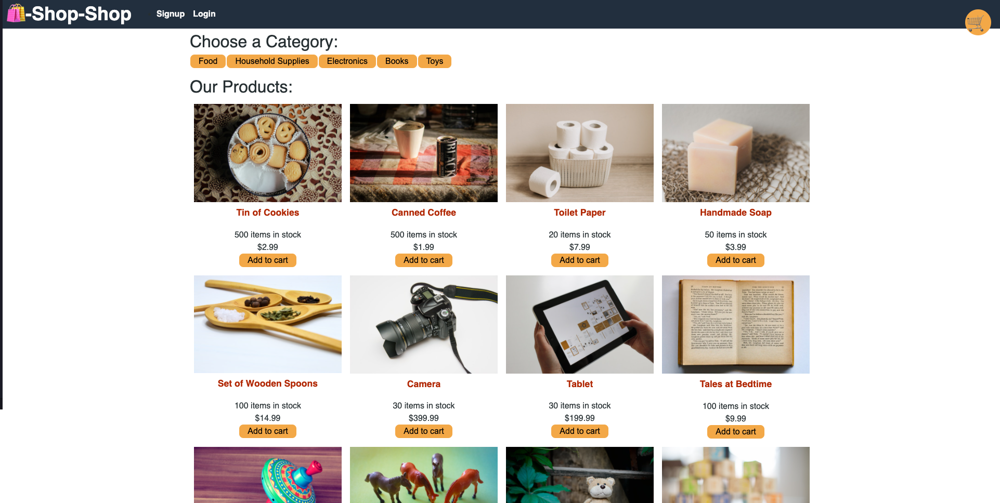

# Shop Shop

This is a online shop that allows you to search for products by category and purchase items after adding them to your cart.

**Link to GitHub Repo:** https://github.com/rachealcolbert/shop-shop

**Link to Deployed App:** https://newshopshop.herokuapp.com/

**Screenshot of Application:**

## Description

GIVEN an e-commerce platform that uses Redux to manage global state
WHEN I review the app’s store
THEN I find that the app uses a Redux store instead of the Context API
WHEN I review the way the React front end accesses the store
THEN I find that the app uses a Redux provider
WHEN I review the way the app determines changes to its global state
THEN I find that the app passes reducers to a Redux store instead of using the Context API
WHEN I review the way the app extracts state data from the store
THEN I find that the app uses Redux instead of the Context API
WHEN I review the way the app dispatches actions
THEN I find that the app uses Redux instead of the Context API

## Credits

The creator of this project's email and GitHub is below.

- [GitHub](https://github.com/rachealcolbert)
- rachealcolbert16@gmail.com

## Contributing

No contributions are needed on this project.
